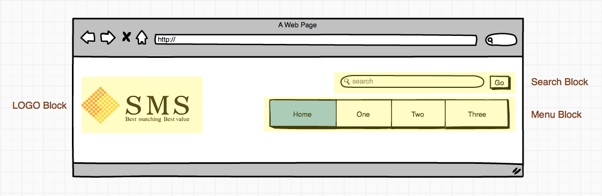
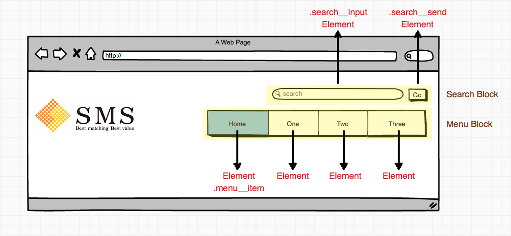
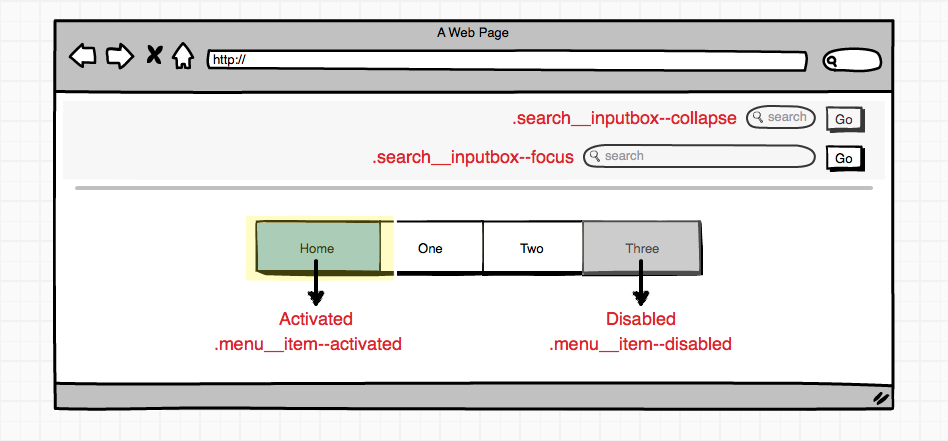

SMS-CSS-Guidelines
==================
A CSS draft guidelines to discuss. 
We will try to adopt object-oriented CSS methodology in this draft.

High-Level Principle
--------------------
### Good CSS Architecture [[1]]
- Predictable 
- Reusable 
- Maintainable 
- Scalable

Syntax and Formatting
---------------------

Commenting
----------

Naming Convention
-----------------
A good naming convention will help your and your team [[3]]
  
- what type of thing a class does;
- where a class can be used;
- what (else) a class might be related to.

### BEM Methodology
#### Introduction
BEM - meaning blocks, elements and modifiers - is a front-end naming methodologies introduced by Yandex [[2]]. The architecture 
allows you maintaining your project with more flexibility and mantainability in a schematic manner. 
The point of OOCSS is to tell other developers what piece of markup is doing by looking its name.
You can easily understand the relationship of a child element and its precedent block.  

#### Blocks
Block was a part of a page design or layout whose specific and unique meaning was defined either semantically or visually [[8]]. Block is a visual and functional component of the interface. It is reusable and should be independently existed.

For example, Menu Block, Logo Block, Search Block, Auth Block.



##### Naming Rule
Naming of blocks is quite simple. As long as the block is self-explaining. Single dash (-) is allowed if needed. (This could be alter with camelCase naming [[10]], wait for further discussion) 

- ```.button```
- ```.text-field```
- ```.flyout```
- ```.heading```
- ```.menu```

Or with prefix, ```b-``` for block, ```c-``` or ```j-``` for js block and ```g-``` for global etc.. Prefix is optional.
- ```.b-button```
- ```.b-text-field```
- ```.b-flyout```
- ```.b-heading```
- ```.b-menu```

HTML Example:
```html
<ul class="menu">
  <li>
    <a href="#">foo</a>
  </li>
  <li>...</li>
</ul>  
```

#### Elements
Element is a component part of block. It only exists within block and can not be used on its own outside of the block.
 
For example, Menu block has menu items, heading block has logo element and slogan element.



##### Naming Rule 
Element use double underline(__) as a prefix. For example ```.block__element``` represents a descendent of ```.block```.

- ```.button__icon```
- ```.text-field__label```
- ```.flyout__title```
- ```.heading__logo```
- ```.menu__item```

HTML Example:
```html
<ul class="menu">
  <li class="menu__item">
    <a href="#">foo</a>
  </li>
  <li class="menu__item">
    <a href="#">bar</a>
  </li>
</ul>  
```

#### Modifiers
 ```Modifier``` in BEM is similar to ```State``` in SMACSS. It is used to defined the state of element or block.
 Multiple modifiers can be used on the same block simultaneously. 
 For example, a button block may have multiple states such as enabled, disabled or hover. Skin and theme could also be a modifier: shadowed, bordered etc..
 
 

##### Naming Rule
For modifier, we use double hyphens(--) as prefix which was first introduced in this article [MindBEMding][6]. 
If the name name of that modifier is too long, also separate it with double hyphens. (This could be alter, wait for further discussion.)

- ```.button--theme-green```
- ```.text-field--disabled```
- ```.flyout--align--top```
- ```.heading--dark--background```
- ```.menu__item--promo```

HTML Example:
```html
<ul class="menu">
  <li class="menu__item--promo">
    <a href="#">foo</a>
  </li>
  <li class="menu__item">
    <a href="#">bar</a>
  </li>
</ul>  
```

#### Quick Summarize
- ```.block {…}```
- ```.block—-modifier {…}``` 
- ```.block__element {…}```
- ```.block__element—modifier {…}```

#### More Sophisticated Examples

##### Drop tag names and IDs
By following BEM (or any other methodology), we no longer need to use tag names and IDs as selectors. In fact, 
we should never use tag names and IDs, this may result in faster selectors and faster render time.

##### Reuse same semantics block on any tag
```html
<div class="block"></div>
<span class="block"></span>
<table class="block"></table>
```

##### CSS Specificity problem solved
CSS selector has priority rules, that is, by specifity first, then by rule order. Oftenly, 
overwriting other developers' selector will result like this due to specificity:
 
```css
#jsn_form_5 .form-actions .form-extra-message {
  font-size: 1.4em;
  color: #c25b5b;
  margin: 6px 0;
}
#jsn_form_7 .form-actions .form-extra-message {
  font-size: 1.4em;
  color: #c25b5b;
  margin: 6px 0;
}
```

Thanks to the OOCSS methodologies, blocks are independent and decouple with html tags.  

##### LESS
We may write our less code in nested way:
```sass
.block {
    &__element {
        &--modifier {
        }
    }
}
```
This will output:
```css
.block {}
.block__element {}
.block__element--modifier {}
```

##### Real-World Frameworks Implemented in BEM style
Adobe Topcoat

http://topcoat.io/

inuit.css - Powerful, scalable, Sass-based, BEM, OOCSS framework.

https://github.com/csswizardry/inuit.css

#### Downside
##### Ugly?!
I know.

But after all, it's all about consistency, readability, and maintainability.

Whilst the CSS language doesn't actually allow object-oriented programming, following a syntax structure like BEM can still enforce the consistency between projects.
Without consistency, taking-off the projects other people hand to you may cause you spending more time on trying to figure out what their code really does.

For example, one might be curious what's the difference between '2-3 classes chained together' versus '2-3 parts separated by dashes and underscores(uhhh)'? 

```html
<a class='btn btn-large'>
```

The former one implied that there might be 2-3 different classes, and this will be confusing to future maintainers because
they won't understand why there are 3 classes on an element and the relationship among classes is unclear.
In our example is whether ```btn-large``` is sufficient on its own, or whether it depends on the class btn being present? Is the base style defined in ```.btn``` only or both in ```.btn, .btn-large```?
Then what if someone forget to include ```.btn```?

##### Fragmentation
Since the merit of BEM is to isolate every visual block. Your CSS might end up with tons of modifier classes when you find yourself with 10 different link styles, 12 shades of blue, 18 subtly different button styles[11] etc..
 
#### Future Methodology
Don't like '__-__---_-__-'?

There is a promising elegant solution called <b>AM - Attribute Modules for CSS</b>[[11]] [[12]], I highly recommend you read through it.

 
Credits
-------
1. [CSS Architecture](http://philipwalton.com/articles/css-architecture/) by Philip Walton
2. [BEM](http://bem.info/) by Yandex
3. http://cssguidelin.es/
4. http://www.slideshare.net/kurotanshi/css-oocss-smacss-bem
5. https://github.com/bjankord/CSS-Components-Modifiers-And-Subcomponents-Collection
6. http://csswizardry.com/2013/01/mindbemding-getting-your-head-round-bem-syntax/
7. http://www.slideshare.net/VarvaraStepanova/bem-it-introduction-to-bem-methodology
8. http://www.smashingmagazine.com/2013/02/21/the-history-of-the-bem-methodology/
9. http://www.sitepoint.com/css-sass-styleguide/
10. https://github.com/suitcss/suit/blob/master/doc/naming-conventions.md#components
11. http://glenmaddern.com/articles/introducing-am-css
12. http://amcss.github.io/
13. http://topcoat.io/
14. http://nicolasgallagher.com/about-html-semantics-front-end-architecture/

[1]:  http://philipwalton.com/articles/css-architecture/ 
[2]:  http://bem.info/ "by Yandex"
[3]:  http://cssguidelin.es/
[4]:  http://www.slideshare.net/kurotanshi/css-oocss-smacss-bem
[5]:  https://github.com/bjankord/CSS-Components-Modifiers-And-Subcomponents-Collection
[6]:  http://csswizardry.com/2013/01/mindbemding-getting-your-head-round-bem-syntax/
[7]:  http://www.slideshare.net/VarvaraStepanova/bem-it-introduction-to-bem-methodology
[8]:  http://www.smashingmagazine.com/2013/02/21/the-history-of-the-bem-methodology/
[9]:  http://www.sitepoint.com/css-sass-styleguide/
[10]: https://github.com/suitcss/suit/blob/master/doc/naming-conventions.md#components
[11]: http://glenmaddern.com/articles/introducing-am-css
[12]: http://amcss.github.io/
[13]: http://topcoat.io/